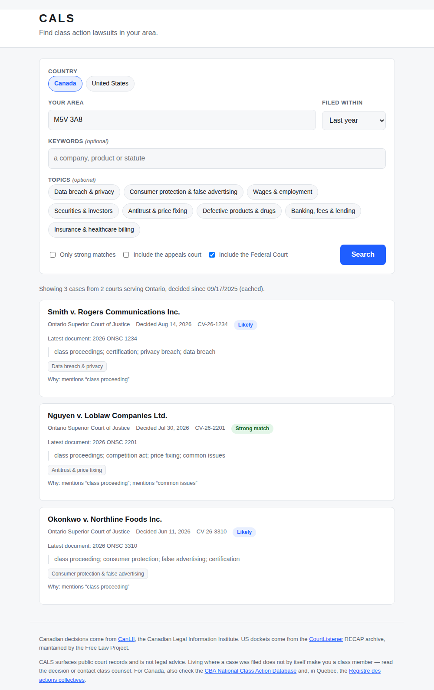

# CALS — Class Action Lawsuit Search

Find class action lawsuits in your area, in **Canada** or the **United States**.

Type a postal code, get the class proceedings running in the courts that serve
you — who is suing whom, over what, and a link to the real decision.



## Canada and the US work differently

The two countries are not symmetrical, and the app does not pretend otherwise.

| | Canada | United States |
| --- | --- | --- |
| Source | [CanLII](https://www.canlii.org/) | [CourtListener / RECAP](https://www.courtlistener.com/) |
| What is indexed | **Decisions** (judgments) | **Filings** (dockets) |
| So you find | Active class proceedings once a judge has ruled | Cases from the day they are filed |
| Courts | 13 superior courts + Federal Court | 94 federal district courts |
| Key needed | Yes — required | Recommended |

**Canada has no PACER.** There is no public docket system, so a newly filed
Canadian class action is invisible until a judge writes something about it —
usually a certification (or, in Quebec, authorization) ruling. CALS therefore
finds *active* Canadian class proceedings, not brand-new claims. For the
newest filings, check the CBA and Quebec registries linked at the bottom of
the app.

### Canadian courts

Class proceedings start in each province's superior court — Ontario Superior
Court of Justice, Superior Court of Quebec, Supreme Court of British Columbia,
Court of King's Bench of Alberta, and so on. The Federal Court has nationwide
jurisdiction over claims against the federal Crown and is included by default.
All 13 provinces and territories are mapped, with courts of appeal optional.

Location input accepts a postal code (`M5V 3A8`), a province (`Ontario`, `QC`,
`Québec`), or a major city (`Toronto`, `Montréal`, `Iqaluit`).

### Why federal courts in the US

US class actions are overwhelmingly filed in — or removed to — federal district
court, largely because of the Class Action Fairness Act. All 94 district courts
are mapped, plus each state's circuit court if you want appeals.

## Quick start

```bash
pip install -r requirements.txt
./run.sh
```

Then open <http://127.0.0.1:8000>.

### Canada: a CanLII API key is required

CanLII's API is the only sanctioned programmatic source for Canadian court
data, and it needs a key. **Canadian search does nothing without one** — the
app returns a 401 saying exactly that rather than failing quietly.

1. Request a free key at <https://developer.canlii.org/>
2. Export it:

```bash
export CANLII_API_KEY=your-key-here
./run.sh
```

Why a key and not scraping? The CBA's National Class Action Database
disallows automated access in its `robots.txt`, and the Quebec registry sits
behind a bot challenge. Both are excellent to read by hand, and the app links
to them, but neither may be crawled.

### US: a CourtListener token is recommended

Anonymous use is capped at **125 requests per day across your whole IP**,
which a couple of searches can exhaust. A free token raises this to
5,000/hour:

1. Register at <https://www.courtlistener.com/sign-in/>
2. Copy your token from <https://www.courtlistener.com/profile/api-token/>

```bash
export COURTLISTENER_TOKEN=your-token-here
```

## Configuration

| Variable | Default | Purpose |
| --- | --- | --- |
| `CANLII_API_KEY` | *(none)* | **Required** for Canadian search |
| `CANLII_LANGUAGE` | `en` | `en` or `fr` for CanLII metadata |
| `CANLII_METADATA_BUDGET` | `120` | Case lookups per Canadian search |
| `COURTLISTENER_TOKEN` | *(none)* | API token; lifts the US rate limit |
| `CALS_CACHE_PATH` | `cals-cache.sqlite3` | Response cache location |
| `CALS_CACHE_TTL` | `3600` | Cache lifetime in seconds |
| `CALS_TIMEOUT` | `30` | Upstream request timeout |
| `CALS_MAX_RESULTS` | `60` | Hard ceiling on results per search |
| `HOST` / `PORT` | `127.0.0.1` / `8000` | Where to listen |

Identical searches are served from a SQLite cache, which is what keeps the app
usable inside the rate limit.

## HTTP API

### `GET /api/search`

| Parameter | Default | Meaning |
| --- | --- | --- |
| `location` | *required* | Postal code, ZIP, province/state, or Canadian city |
| `country` | *inferred* | `CA` or `US`; disambiguates a bare code |
| `keywords` | `""` | Extra full-text terms (a company, product, statute) |
| `topics` | `""` | Comma-separated topic keys |
| `days` | `365` | Look back this many days (1–3650) |
| `min_confidence` | `0.35` | Drop results scoring below this (0–1) |
| `include_appeals` | `false` | Also search the court of appeal |
| `include_federal` | `true` | Canada only: include the Federal Court |
| `limit` | `40` | Maximum results (1–200) |

```bash
curl "http://127.0.0.1:8000/api/search?location=M5V%203A8&topics=data_privacy&days=180"
```

> `CA` on its own means **California**, because US ZIP and state codes are
> tried first. Pass `country=CA` for Canada — the web UI always sends it.

```jsonc
{
  "cases": [
    {
      "case_name": "Weatherford v. Metabase, Inc.",
      "court": "California Northern District Court",
      "court_id": "cand",
      "state": "CA",
      "docket_number": "4:26-cv-09406",
      "date_filed": "2026-09-02",
      "nature_of_suit": "380 Personal Property: Other",
      "url": "https://www.courtlistener.com/docket/74739752/...",
      "confidence": 1.0,
      "confidence_reasons": ["mentions “class action complaint”", "..."],
      "topics": ["data_privacy"],
      "snippet": "brings this class action on behalf of all others similarly situated..."
    }
  ],
  "total_available": 523,
  "cached": false,
  "notes": ["1 docket(s) did not meet the confidence threshold and were left out."],
  "query": { "state": "CA", "courts": ["cand", "cacd", "caed", "casd"], "...": "..." }
}
```

Other endpoints: `GET /api/regions?country=CA`, `GET /api/topics`,
`GET /api/health`. Interactive docs are at `/docs`.

## How a case is identified as a class action

Neither country flags class actions in its data, so it has to be inferred —
differently in each.

### Canada

CanLII's API has **no full-text search**. It browses a court's decisions by
date and returns titles, then exposes editorial `keywords` one case at a time.
So each search lists a date window cheaply, then spends a bounded budget of
metadata lookups (120 by default), newest first, reading keywords. Canadian
results are therefore a **bounded scan, not an exhaustive one**, and the app
says so when the budget runs out.

Scoring matches the vocabulary actually used in Canadian courts, in both
official languages, and Quebec differs from the rest of the country:

| Common law provinces | Quebec |
| --- | --- |
| "class proceeding", "certification" | "action collective", "autorisation" |
| *Class Proceedings Act* | formerly "recours collectif" |
| "representative plaintiff", "common issues" | "membre du groupe" |

Criminal styles of cause (`R. v. …`) are ruled out from the title alone, so
they never consume the lookup budget.

### United States

Every search is constrained upstream to dockets whose *full text* contains
class action language. Each result is then scored on the fragment that comes
back — case name, cause, nature of suit, and a document snippet.

Because that snippet is often just the caption page of a complaint, a genuine
class action can score zero locally. The upstream match is real evidence, so
it sets a **floor of 0.35** rather than letting the case be dropped. That
floor is withheld from criminal, habeas and immigration dockets, where a
full-text hit is almost always a brief citing some other case.

### Labels

| Score | Label | Meaning |
| --- | --- | --- |
| ≥ 0.75 | Strong match | Class action language visible in the record itself |
| 0.5 – 0.74 | Likely | Partial corroboration |
| < 0.5 | Possible | Weak or indirect evidence; verify before relying on it |

"Only strong matches" raises the threshold to 0.6. Every card shows a **Why**
line listing exactly what it matched on.

### Topics

Topics cover both languages, so `protection du consommateur` tags the same
way as `consumer protection`. In the US they are ANDed into the upstream
query and deliberately **not** re-filtered locally — the archive checked them
against full text, and re-checking a short snippet would throw away real
matches. The tags shown are only those visible in the record, so a securities
case is never labelled "data breach" just because that was your filter.

## Limitations

Read these before relying on a result.

**Canada**

- **Decisions, not filings.** A class action that has been filed but not yet
  ruled on is invisible here. Check the [CBA National Class Action
  Database](https://cbaapps.org/ClassAction/Search.aspx) and the [Registre des
  actions collectives](https://www.registredesactionscollectives.quebec/) for
  the newest claims.
- **Bounded scan.** No full-text search exists, so each search reads the most
  recent decisions within a lookup budget rather than every decision.
- **The court table is unverified.** The CanLII database ids in
  `cals/courts_ca.py` were written without a key and have never been checked
  against the live API. Run `scripts/verify_canlii_courts.py` with your key.
- **The Canadian adapter has never run against live CanLII.** It is built to
  the documented API contract and covered by tests using mocked responses, but
  no real CanLII response has ever passed through it.

**United States**

- **Federal only.** State-court class actions are not in RECAP.
- **RECAP is a mirror, not all of PACER.** It holds what users have purchased
  and contributed.

**Both**

- **Filed-in is not the same as covers-you.** A nationwide class action filed
  elsewhere may cover you; one in your own province may not.
- **Heuristics, not adjudication.** Nothing here is a court's determination
  that a case is a class action. A case can be started as one and never be
  certified or authorized.
- **Not legal advice.** To find out whether you are a class member, read the
  decision or contact class counsel.

## Development

```bash
pip install -r requirements-dev.txt
python3 -m pytest              # 208 tests, no network required
```

Tests stub the upstream API with `httpx.MockTransport`, so the suite is
offline and deterministic.

Both court tables are hand-maintained. To re-check them against their APIs:

```bash
python3 scripts/verify_courts.py                    # US, 94 district courts
CANLII_API_KEY=... python3 scripts/verify_canlii_courts.py   # Canada
```

### Layout

```
cals/
  app.py                    FastAPI routes, country routing
  courts.py                 US state <-> federal district court (94 courts)
  courts_ca.py              CA province <-> CanLII court ids
  geo.py                    postal code / ZIP / province / state / city
  classify.py               scoring and topics, EN + FR
  cache.py                  SQLite TTL cache
  config.py                 env-var settings
  models.py                 normalized Case / SearchResult
  sources/
    base.py                 the interface a case source implements
    canlii.py               CanLII adapter (Canada)
    courtlistener.py        CourtListener / RECAP adapter (US)
static/                     single-page frontend, no build step
tests/                      pytest suite
scripts/                    court table verification scripts
```

Adding another source means implementing `search(SearchQuery) -> SearchResult`
in `cals/sources/` and registering it in `app.py`.

## Data & licence

Canadian decisions come from [CanLII](https://www.canlii.org/), maintained by
the Federation of Law Societies of Canada. US dockets come from the
[CourtListener](https://www.courtlistener.com/) RECAP archive, maintained by
the non-profit [Free Law Project](https://free.law/). Please use both within
their terms: [CanLII](https://www.canlii.org/en/info/terms.html),
[CourtListener](https://www.courtlistener.com/terms/).

Sources that are **not** used, deliberately: the CBA National Class Action
Database (`robots.txt` disallows automated access) and the Quebec Registre des
actions collectives (bot challenge). Both are linked from the app for reading
by hand.
