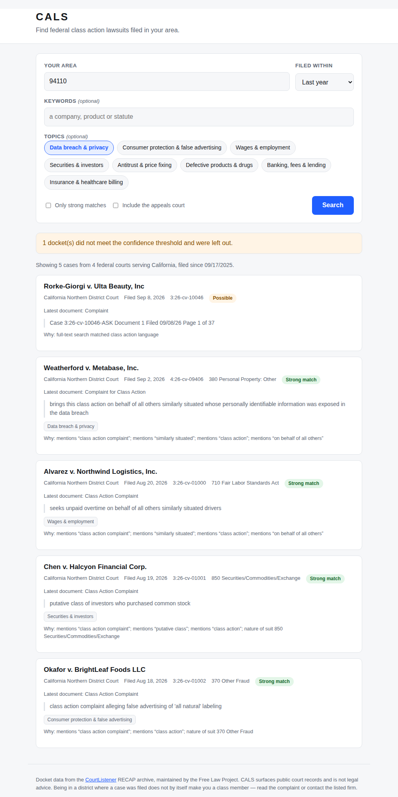

# CALS — Class Action Lawsuit Search

Find federal class action lawsuits filed in your area.

Type a ZIP code, get the class actions recently filed in the federal district
courts that serve you — who is suing whom, over what, and a link to the real
docket.



## Why federal courts

Class actions are overwhelmingly filed in — or removed to — federal district
court, largely because of the Class Action Fairness Act. So "lawsuits in my
area" is modelled here as "dockets in the federal district courts whose
territory covers my state". All 94 district courts are mapped, plus the
circuit court for each state if you want appeals too.

## Quick start

```bash
pip install -r requirements.txt
./run.sh
```

Then open <http://127.0.0.1:8000>.

### Get an API token (strongly recommended)

CALS reads from the [CourtListener](https://www.courtlistener.com/) RECAP
archive, run by the Free Law Project. Anonymous use is capped at **125
requests per day across your whole IP**, which a couple of searches can
exhaust. A free token raises this to 5,000/hour:

1. Register at <https://www.courtlistener.com/sign-in/>
2. Copy your token from <https://www.courtlistener.com/profile/api-token/>

```bash
export COURTLISTENER_TOKEN=your-token-here
./run.sh
```

Without a token the app still works; it will just tell you when it has been
rate limited rather than failing silently.

## Configuration

| Variable | Default | Purpose |
| --- | --- | --- |
| `COURTLISTENER_TOKEN` | *(none)* | API token; lifts the rate limit |
| `CALS_CACHE_PATH` | `cals-cache.sqlite3` | Response cache location |
| `CALS_CACHE_TTL` | `3600` | Cache lifetime in seconds |
| `CALS_TIMEOUT` | `30` | Upstream request timeout |
| `CALS_MAX_RESULTS` | `60` | Hard ceiling on results per search |
| `HOST` / `PORT` | `127.0.0.1` / `8000` | Where to listen |

Identical searches are served from a SQLite cache, which is what keeps the app
usable inside the rate limit.

## HTTP API

### `GET /api/search`

| Parameter | Default | Meaning |
| --- | --- | --- |
| `location` | *required* | ZIP code, state code, or state name |
| `keywords` | `""` | Extra full-text terms (a company, product, statute) |
| `topics` | `""` | Comma-separated topic keys |
| `days` | `365` | Look back this many days (1–3650) |
| `min_confidence` | `0.35` | Drop results scoring below this (0–1) |
| `include_appeals` | `false` | Also search the state's circuit court |
| `limit` | `40` | Maximum results (1–200) |

```bash
curl "http://127.0.0.1:8000/api/search?location=94110&topics=data_privacy&days=180"
```

```jsonc
{
  "cases": [
    {
      "case_name": "Weatherford v. Metabase, Inc.",
      "court": "California Northern District Court",
      "court_id": "cand",
      "state": "CA",
      "docket_number": "4:26-cv-09406",
      "date_filed": "2026-09-02",
      "nature_of_suit": "380 Personal Property: Other",
      "url": "https://www.courtlistener.com/docket/74739752/...",
      "confidence": 1.0,
      "confidence_reasons": ["mentions “class action complaint”", "..."],
      "topics": ["data_privacy"],
      "snippet": "brings this class action on behalf of all others similarly situated..."
    }
  ],
  "total_available": 523,
  "cached": false,
  "notes": ["1 docket(s) did not meet the confidence threshold and were left out."],
  "query": { "state": "CA", "courts": ["cand", "cacd", "caed", "casd"], "...": "..." }
}
```

Other endpoints: `GET /api/states`, `GET /api/topics`, `GET /api/health`.
Interactive docs are at `/docs`.

## How a case is identified as a class action

PACER has no "is this a class action" flag, so it has to be inferred. Two
layers do this, and the split matters:

**Upstream**, every search is constrained to dockets whose *full text*
contains class action language (`"class action"`, `"similarly situated"`,
`"class certification"`). The archive matches this against entire filings.

**Locally**, each result is scored on the fragment we get back — the case
name, cause, nature of suit, and a short document snippet. Scoring is
additive over phrases like "class action complaint" or "on behalf of all
others similarly situated", plus the JS-44 nature-of-suit code.

Because the snippet is often just the caption page of a complaint, a genuine
class action can score zero locally. The upstream match is real evidence, so
it sets a **floor of 0.35** rather than letting such a case be dropped. That
floor is withheld from dockets whose own type rules a class action out —
criminal cases (`-cr-` docket numbers), habeas, and immigration proceedings —
where a full-text hit is almost always a brief citing some other case.

Results are labelled honestly:

| Score | Label | Meaning |
| --- | --- | --- |
| ≥ 0.75 | Strong match | Class action language visible in the docket itself |
| 0.5 – 0.74 | Likely | Partial corroboration |
| < 0.5 | Possible | Matched on full text we cannot see; verify before relying on it |

"Only strong matches" in the UI raises the threshold to 0.6. Every card shows
a **Why** line listing exactly what it matched on, so you can judge for
yourself.

### Topics

Topic filters are ANDed into the *upstream* query, so they narrow what the
archive returns. They deliberately do **not** filter results again locally:
the archive checked them against full text, and re-checking against a short
snippet would throw away real matches. The tags shown on each card are only
the topics actually visible in that docket's text, so a securities case is
never labelled "data breach" just because that was your filter.

## Limitations

- **Federal only.** State-court class actions are not in RECAP. A case filed
  in state court will not appear.
- **RECAP is a mirror, not all of PACER.** It holds what users have purchased
  and contributed. Coverage is very good for newly filed civil complaints but
  is not guaranteed to be complete.
- **Filed-in is not the same as covers-you.** A nationwide class action filed
  in Delaware may cover you; one filed in your district may not. The district
  is a starting point for finding cases, not a test of membership.
- **Heuristics, not adjudication.** Nothing here is a court's determination
  that a case is a class action. A case can be filed as one and never certified.
- **Not legal advice.** To find out whether you are a class member, read the
  complaint or contact the firm listed on the docket.

## Development

```bash
pip install -r requirements-dev.txt
python3 -m pytest              # 103 tests, no network required
```

Tests stub the upstream API with `httpx.MockTransport`, so the suite is
offline and deterministic.

The court table in `cals/courts.py` is hand-maintained. To re-check it
against CourtListener:

```bash
python3 scripts/verify_courts.py
```

### Layout

```
cals/
  app.py                  FastAPI routes
  courts.py               state <-> federal court mapping (94 district courts)
  geo.py                  ZIP / state-name resolution
  classify.py             class action scoring and topic detection
  cache.py                SQLite TTL cache
  config.py               env-var settings
  models.py               normalized Case / SearchResult
  sources/
    base.py               the interface a case source implements
    courtlistener.py      CourtListener / RECAP adapter
static/                   single-page frontend, no build step
tests/                    pytest suite
scripts/verify_courts.py  checks courts.py against the live API
```

Adding another source means implementing `search(SearchQuery) -> SearchResult`
in `cals/sources/` and registering it in `app.py`.

## Data & licence

Docket data comes from the [CourtListener](https://www.courtlistener.com/)
RECAP archive, maintained by the non-profit [Free Law
Project](https://free.law/). Please use it considerately and within their
[terms](https://www.courtlistener.com/terms/).
